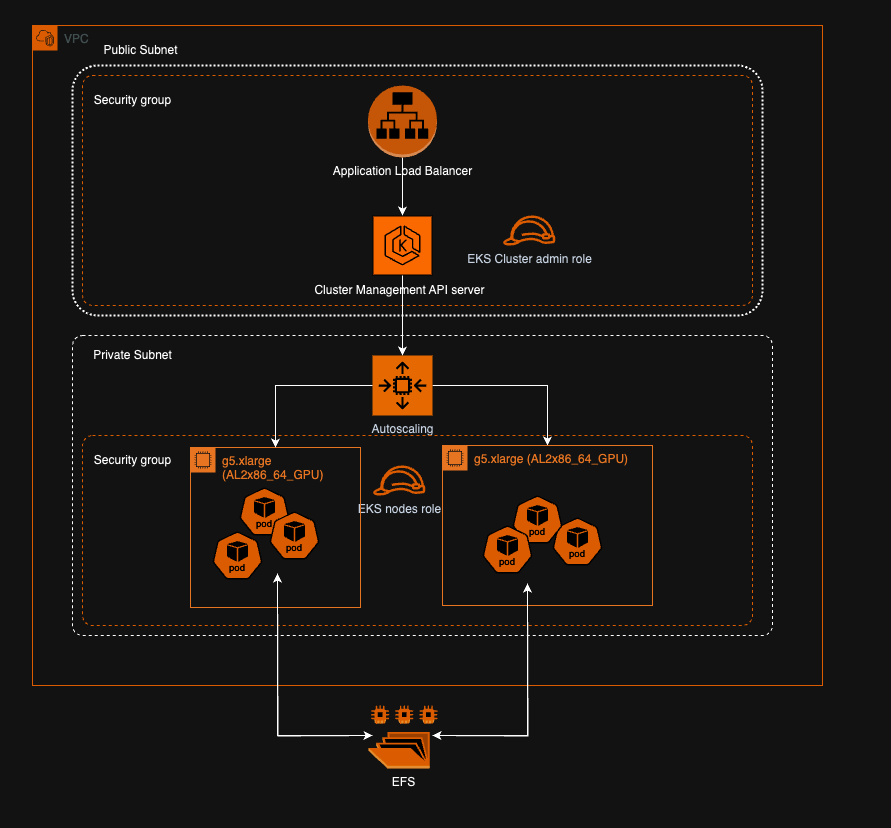

# Vista-3D NIM on EKS

The Versatile Imaging SegmenTation and Annotation ([VISTA](https://docs.nvidia.com/ai-enterprise/nim-medical-imaging/latest/vista-3d.html)) model combines semantic segmentation with interactivity, offering high accuracy and adaptability across diverse anatomical areas for medical imaging.



## Pre-Requisites

* [EKS Cluster](https://github.com/awslabs/data-on-eks/tree/main/ai-ml/bionemo) with [AWS Load Balancer Controller](https://docs.aws.amazon.com/eks/latest/userguide/lbc-helm.html) and [Amazon CloudWatch Observability](https://docs.aws.amazon.com/eks/latest/userguide/workloads-add-ons-available-eks.html#amazon-cloudwatch-observability) 
* [Kubectl](https://kubernetes.io/docs/tasks/tools/)
* [Helm](https://helm.sh/docs/helm/helm_install/) kubernetes deployment tool
* Install [3D Slicer](https://www.slicer.org/) to view .nrrd files returned from vista3d

## Setup NVIDIA Developer Account

Procure a NGC API KEY from [NVIDIA](https://catalog.ngc.nvidia.com/) to pull images from NGC. Create an account and provision an API Key.

## NGC Docker Images

Docker Login to NGC registry

```bash
echo "$NGC_API_KEY" | docker login nvcr.io --username '$oauthtoken' --password-stdin
```

Pull the vista3d image

```bash
docker pull nvcr.io/nvidia/nim/medical_imaging_vista3d
```

Run the image and create a shell to investigate the container

```bash
docker run -it $IMAGE_ID sh
```

## Create EKS cluster with add-ons

First clone the [Data-on-EKS](https://github.com/awslabs/data-on-eks) repo and go to [bionemo folder](https://github.com/awslabs/data-on-eks/tree/main/ai-ml/bionemo) with installation script. Before deployment, you shall use any preferred code editor to change the [instance size in eks.tf](https://github.com/awslabs/data-on-eks/blob/main/ai-ml/bionemo/eks.tf#L117) file for hosting NIM container to smaller ones, e.g. g5.xlarge; change the EKS cluster name to vistanim-on-eks in [variables.tf file](https://github.com/awslabs/data-on-eks/blob/main/ai-ml/bionemo/variables.tf#L3) and change the [AWS region in the same file](https://github.com/awslabs/data-on-eks/blob/main/ai-ml/bionemo/variables.tf#L10) to where you want to host the inference endpoint, e.g. us-east-1. To deploy the stack, you can run the following command after you made the change to instance size and AWS region:

```bash
./install.sh 
```

Once it finished successfully, configure the kubectl:
```bash
aws eks update-kubeconfig --name vistanim-on-eks --region <region>
```

## Deploy the NIM to an EKS Cluster Using the NIM-Deploy Helm chart

Clone the [NVIDIA nim-deploy repo](https://github.com/NVIDIA/nim-deploy/tree/main) and move [the helm folder](https://github.com/NVIDIA/nim-deploy/tree/main/helm) into current folder. Edit the VISTA-3D NIM configuration file to replace the container image repository and tag with the one in your private ECR. Then deploy the vista NIM using nim-deploy helm chart

```bash
export NGC_API_KEY=<NGC_API_KEY_HERE>
helm --namespace vista install vista helm/nim-llm/ --create-namespace --set model.ngcAPIKey="$NGC_API_KEY" -f vista3d-values.yaml
```

Check your pods to ensure they are up and healthy. Pods should be in a Running state and 1/1 Ready status.

```bash
kubectl get pods -n vista -o wide
NAME      READY   STATUS    RESTARTS   AGE     IP               NODE                                          NOMINATED NODE   READINESS GATES
vista-0   1/1     Running   0          5h43m   100.64.125.xxx   ip-100-64-89-xxx.us-west-2.compute.internal   <none>           <none>
vista-1   1/1     Running   0          4h26m   100.64.2.xxx     ip-100-64-89-xxx.us-west-2.compute.internal   <none>           <none>
```

Check your Kubernetes services to ensure they are listening on port 8008 for your NIM inference API endpoints.

```bash
kubectl get svc -n vista -o wide
NAME                TYPE        CLUSTER-IP      EXTERNAL-IP   PORT(S)    AGE   SELECTOR
vista-nim-llm       ClusterIP   172.20.23.115   <none>        8008/TCP   28h   app.kubernetes.io/instance=vista,app.kubernetes.io/name=nim-llm
vista-nim-llm-sts   ClusterIP   None            <none>        8008/TCP   28h   app.kubernetes.io/instance=vista,app.kubernetes.io/name=nim-llm
```

Setup an ALB Controller Ingress to allow traffic to the NIM Inference endpoints.

Follow these docs to install the [AWS ALB Ingress Controller](https://kubernetes-sigs.github.io/aws-load-balancer-controller/v2.2/deploy/installation/) 

Deploy the AWS ALB Ingress from the ingress.yaml configuration file to expose the vista3d NIM

```bash
kubectl apply -f eks/ingress.yaml
```

Check the public address of your ALB generated from the ALB Controller

```bash
kubectl get ing -n vista -o wide
NAME          CLASS   HOSTS   ADDRESS                                                                PORTS   AGE
nim-llm-alb   alb     *       k8s-vista-nimllmal-1951141444-1058888912.us-west-2.elb.amazonaws.com   80      5h42m
```

With the public ALB domain address you can now make requests to your vista3d image endpoint.

```bash
curl -X POST http://{ALB_ADDRESS_HERE}/vista3d/inference \
-H "Content-Type: application/json" \
--output output.nrrd \
-d '{
    "image": "https://assets.ngc.nvidia.com/products/api-catalog/vista3d/example-1.nii.gz",
    "prompts": {
        "classes": ["lung", "heart"]
    }
}'
```

An output file will be created, `output.nrrd`, open it with 3D Slicer if you want to see the result.

