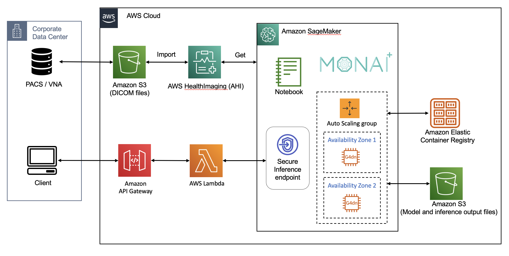
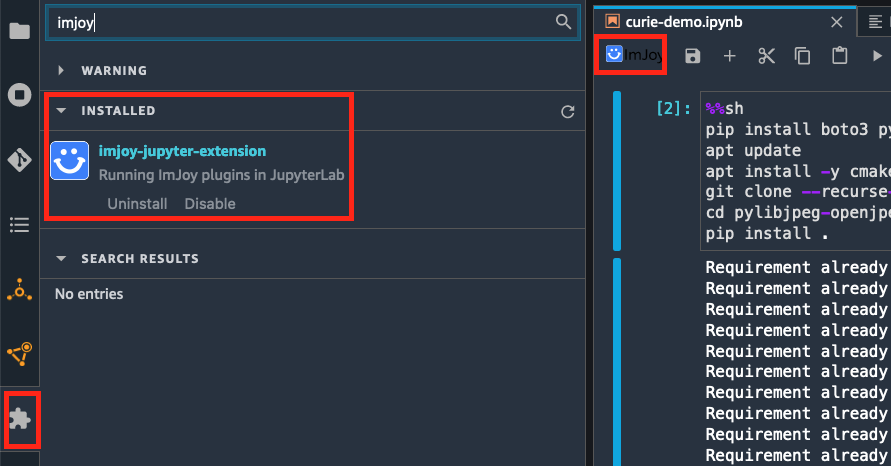

# MONAI on AWS Workshop

## Introduction 

AWS and NVIDIA build applications and solutions to make healthcare more accessible, affordable and efficient by accelerating cloud connectivity of enterprise imaging. [MONAI Deploy](https://monai.io/deploy.html) is one of the key modules within [MONAI](https://monai.io/index.html) (Medical Open Network for Artificial Intelligence) developed a consortium of academic and industry leaders, including NVIDIA. [AWS HealthImaging](https://aws.amazon.com/healthimaging/) (AHI) is a HIPAA-eligible, highly scalable, performant, and cost effective medical imagery store. We have developed a [MONAI Deploy connector](https://github.com/aws-samples/healthlake-imaging-to-dicom-python-module/tree/main) to AWS HealthImaging to integrate medical imaging AI applications with sub-second image retrieval latencies at scale powered by cloud-native APIs. The MONAI AI models and applications can be hosted on [Amazon SageMaker](https://aws.amazon.com/sagemaker/), which is a fully managed service to deploy Machine Learning (ML) models at scale. Amazon SageMaker takes care of setting up and managing instances for inference and provides built-in metrics and logs for endpoints that you can use to monitor and receive alerts. It also offers a variety of NVIDIA GPU instances for ML inference, as well as multiple model deployment options with automatic scaling, including real-time inference, serverless inference, asynchronous inference and batch transform.

## Architecture Diagram

Here is the architecture diagram, showing how MONAI Application Package (MAP) is deployed on Amazon SageMaker managed inference endpoints:

## Prerequisit

1. Use AWS Account with one of the following AWS regions, where AWS HealthImaging is available: North Virginia (us-east-1), Oregon (us-west-2), Ireland (eu-west-1), and Sydney (ap-southeast-2)

2. Create an [Amazon SageMaker studio domain](https://docs.aws.amazon.com/sagemaker/latest/dg/gs-studio-onboard.html) and User Profile with IAM permission to access AWS HealthImaging service

3. Enable JupyterLab v3 extension and install ‘Imjoy-jupyter-extension' if you want to visualize medical images on SageMaker notebook interactively using [itkwidgets](https://github.com/InsightSoftwareConsortium/itkwidgets):

## License

This library is licensed under the MIT-0 License. See the LICENSE file.
