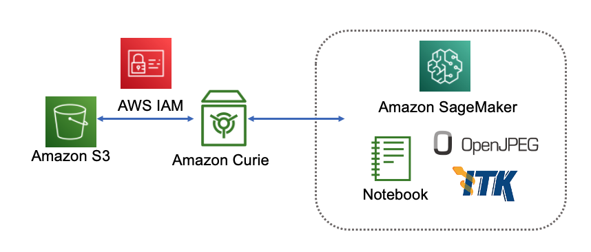
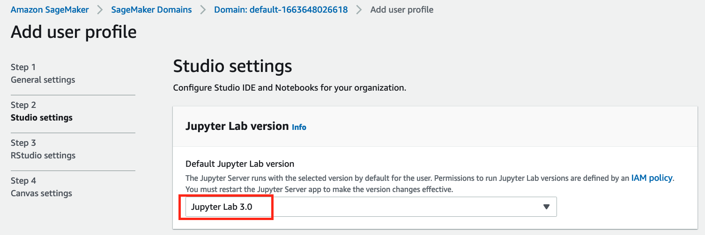

# MONAI on AWS Workshop

## Architecture Diagram

## Prerequisit

1. Use Jupyter Lab v3

2. Install *imjoy-jupyter-extension*

## License

This library is licensed under the MIT-0 License. See the LICENSE file.
