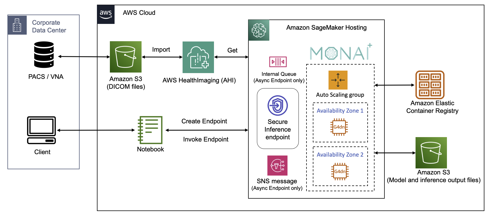

# MONAI on AWS Workshop

## Introduction 

AWS and NVIDIA build applications and solutions to make healthcare more accessible, affordable and efficient by accelerating cloud connectivity of enterprise imaging. [MONAI](https://monai.io/index.html) (Medical Open Network for Artificial Intelligence) is a framework for building and deploying medical AI that is offered as either open-source or as a part of the [NVIDIA AI Enterprise](https://www.nvidia.com/en-us/data-center/products/ai-enterprise/) software suite. It has three key modules to support medical AI development: [MONAI Label](https://monai.io/label.html), [MONAI Core](https://monai.io/core.html), and [MONAI Deploy](https://monai.io/deploy.html). [AWS HealthImaging](https://aws.amazon.com/healthimaging/) (AHI) is a HIPAA-eligible, highly scalable, performant, and cost effective medical imagery store. We have developed an [AWS HealthImaging  python client](https://github.com/aws-samples/healthlake-imaging-to-dicom-python-module/tree/main) as MONAI Deploy connector to integrate medical imaging AI applications with sub-second image retrieval latencies at scale powered by cloud-native APIs. The MONAI AI models and applications can be hosted on [Amazon SageMaker](https://aws.amazon.com/sagemaker/), which is a fully managed service to deploy Machine Learning (ML) models at scale. Amazon SageMaker takes care of setting up and managing instances for model training and inference and provides built-in metrics and logs for endpoints that you can use to monitor and receive alerts. It also offers a variety of NVIDIA GPU instances for ML training and inference, as well as multiple model deployment options with automatic scaling, including real-time inference, serverless inference, asynchronous inference and batch transform.

## Architecture Diagram

Here is the architecture diagram, showing how [MONAI Application Package](https://github.com/Project-MONAI/monai-deploy/blob/main/guidelines/monai-application-package.md) (MAP) can be deployed on Amazon SageMaker managed inference endpoints and make inference predictions on the medical images from AHI:

Here is the architecture diagram, showing how to retreive medical images from AHI and use MONAI Core to train model on Amazon SageMaker:

Where the DICOM headers can be indexed and searched through [Amazon Glue](https://aws.amazon.com/glue/) and [Amazon Athena](https://aws.amazon.com/athena/) 

## Prerequisit

1. Use AWS Account with one of the following AWS regions, where AWS HealthImaging is available: North Virginia (us-east-1), Oregon (us-west-2), Ireland (eu-west-1), and Sydney (ap-southeast-2)

2. Download the [CloudFormation tempalte](https://github.com/aws-solutions-library-samples/guidance-for-multi-modal-data-analysis-with-aws-health-and-ml-services/blob/main/cfn_template) and deploy the template to create [Amazon SageMaker Domain](https://aws.amazon.com/sagemaker/) and necessary [Amazon IAM](https://aws.amazon.com/iam/) roles

3. Launch SageMaker Studio application. 

4. Enable JupyterLab v3 extension and install ‘Imjoy-jupyter-extension' if you want to visualize medical images on SageMaker notebook interactively using [itkwidgets](https://github.com/InsightSoftwareConsortium/itkwidgets):

## License

This library is licensed under the MIT-0 License. See the LICENSE file.
